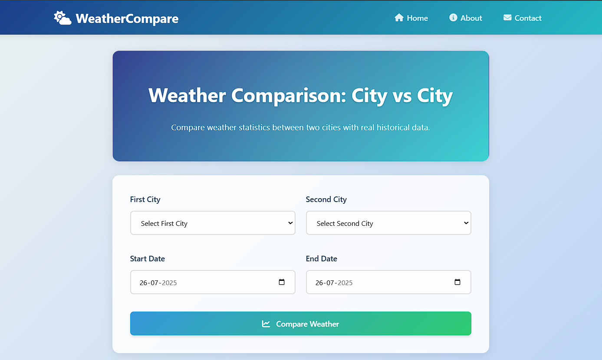
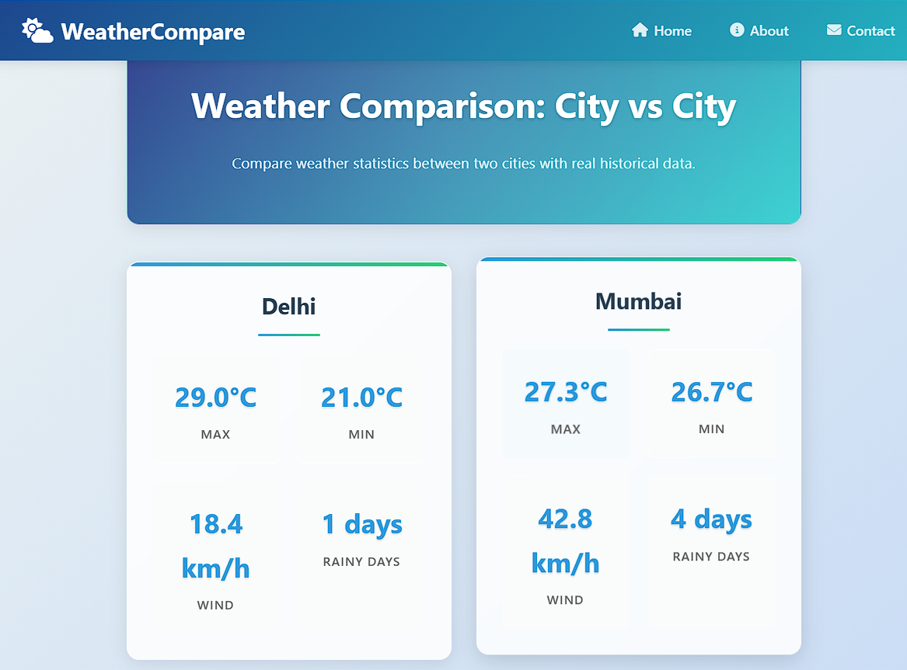
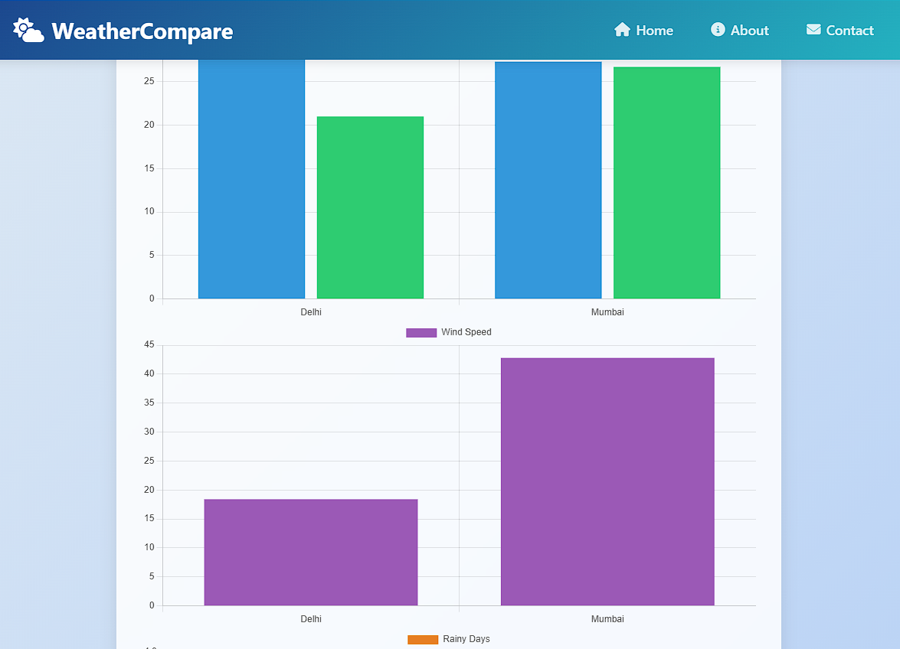

# 🌦️ Weather Comparison App

> **Effortlessly compare weather stats between any two cities with stunning charts and lightning-fast performance.**  
> Powered by **FastAPI**, **Chart.js**, and **AWS S3**.

---

<div align="center">


</div>

---

## 🚀 Features

<div align="center">

| 🌍 Compare any 2 cities | 📅 Flexible date range (up to 14 days) | 📊 Interactive charts | ☁️ Save/load from S3 | 📥 Export as CSV |
|:----------------------:|:--------------------------------------:|:--------------------:|:-------------------:|:---------------:|
| Max/Min Temperature    | Wind Speed                             | Rainy Days           | Browse history      |                 |

</div>

- **Compare** historical weather for any two cities
- **Flexible date range** (up to 14 days)
- **Interactive charts**: Max/Min Temperature, Wind Speed, Rainy Days
- **Save & load** data from **Amazon S3**
- **Browse saved history** (CSV keys from S3)
- **Export results** as CSV
- Built with **FastAPI**, **Jinja2**, **Pandas**, **Boto3**

---

## 🗂️ Project Structure

```plaintext
weather-comparison/
│
├── main.py              # FastAPI app
├── routes/              # Route handlers
│   └── weather_routes.py
├── templates/           # Jinja2 HTML templates
│   ├── base.html
│   ├── weather.html
│   ├── about.html
│   └── contact.html
├── static/              # CSS & JS
│   └── style.css
├── weather/             # App logic
│   └── weather_fetcher.py
├── utils/               # Utility scripts
│   └── s3_utils.py
├── .env                 # Secrets (ignored in Git)
├── .gitignore           # Ignore list
├── requirements.txt     # Python dependencies
└── README.md            # Project documentation
```

---

## 🛠️ Quickstart

**1. Clone & install dependencies**
```bash
git clone https://github.com/Kamal2131/weather-comparison.git
cd weather-comparison
python3 -m venv venv
source venv/bin/activate
pip install -r requirements.txt
```

**2. Configure environment**
```ini
# .env
AWS_ACCESS_KEY_ID=your-access-key
AWS_SECRET_ACCESS_KEY=your-secret-key
AWS_DEFAULT_REGION=your-region
S3_BUCKET_NAME=your-bucket-name
WEATHER_API_KEY=your-weatherapi-key
```

**3. Run the app**
```bash
uvicorn main:app --host 0.0.0.0 --port 8000
```
Visit: [http://localhost:8000](http://localhost:8000)

---

## 🌐 Tech Stack

<div align="center">

| Backend  | Frontend           | Cloud   | Data    | Weather API      |
|----------|--------------------|---------|---------|------------------|
| FastAPI  | Jinja2, Chart.js   | AWS S3  | Pandas  | weatherapi.com   |

</div>

---

## 🗃️ S3 Folder Structure

```plaintext
kkgbucket4121/
└── weather/
    ├── kolkata_2025-07-24_2025-07-22.csv
    ├── delhi_2025-07-24_2025-07-22.csv
    └── ...
```

---

## ✨ Screenshots





---

## 👤 Author

**Kamal Krishna Ghosh**  
Full Stack Developer | Python + FastAPI Enthusiast  
📧 [kamalkrishnaghosh999@gmail.com](mailto:kamalkrishnaghosh999@gmail.com)

---

## 📄 License

Open-source for educational and demo purposes.  
For commercial use, please contact the author.

---


## 🌟 Contributing

1. Fork the repo
2. Create a branch (`feature/YourFeature`)
3. Commit your changes
4. Open a PR

---

## 📚 Resources

- [FastAPI Docs](https://fastapi.tiangolo.com/)
- [Chart.js Docs](https://www.chartjs.org/docs/)
- [Boto3 Docs](https://boto3.amazonaws.com/v1/documentation/api/latest/index.html)
- [Pandas Docs](https://pandas.pydata.org/docs/)
- [WeatherAPI](https://www.weatherapi.com/docs/)